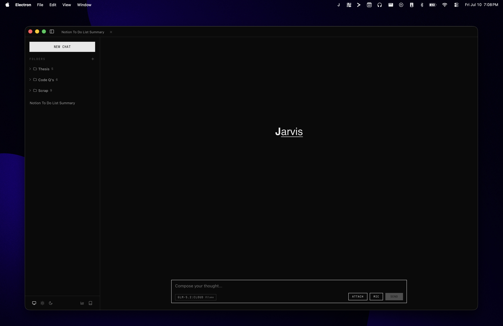

# Jarvis

Jarvis is a local-first macOS desktop assistant for chat, voice dictation, web research, Notion workflows, document inspection, and browser automation. Chat currently uses OpenCode Go or Codex with ChatGPT sign-in. Ollama and OpenRouter chat registration are temporarily disabled; OpenRouter remains available for optional voice refinement.



## What You Can Do

- Chat through OpenCode Go or your connected ChatGPT account.
- Dictate into Jarvis or another focused macOS app with `Cmd+Shift+Space`.
- Transcribe locally with Whisper large-v3-turbo on Apple MLX; Personal Dictionary is currently paused.
- Search the web and fetch public pages for current information.
- Search Notion, query databases, create pages, and append blocks.
- Open and control a separate Jarvis-owned browser workspace.
- Attach documents and render Markdown, code, math, and citations.
- Review local token usage and model response performance.

## Requirements

- macOS on Apple Silicon for voice transcription
- Node.js 22.13 or newer
- pnpm 10.28 or newer
- Python 3.11 or newer for voice features

## Quick Start

```bash
git clone https://github.com/Alaud01/jarvis.git
cd jarvis
pnpm install
cp .env.example .env
```

Open `.env` and add only the credentials for the services you intend to use. Use `OPENCODE_GO_API_KEY` for OpenCode Go, or sign in through **Codex → Connect…** in the app menu. Local voice transcription does not require a cloud key.

Start the development app:

```bash
pnpm dev
```

Jarvis runs in the macOS menu bar. Open it from the tray icon after Electron starts.

## Provider Configuration

| Variable | Enables |
| --- | --- |
| `OPENROUTER_API_KEY` | Optional transcript refinement |
| `OPENCODE_GO_API_KEY` | OpenCode Go models |
| `TAVILY_KEY` | Web search |
| `OLLAMA_BASE_URL` | Retained Ollama setting; chat registration is currently disabled |
| `OLLAMA_API_KEY` | Retained Ollama cloud setting; chat registration is currently disabled |

See [.env.example](./.env.example) for optional provider, voice-model, and timeout settings. Credentials are read from the environment and are not copied into Jarvis application storage.

## Voice Setup

Install the Python sidecar and MLX transcription dependencies:

```bash
pnpm setup:python
```

Voice transcription uses `mlx-community/whisper-large-v3-turbo` locally with Apple MLX and FP16 weights (approximately 1.6 GB). The service loads the model at app launch, releases its weights after 10 minutes of inactivity, and starts reloading as soon as the recording shortcut or button is pressed. The first launch downloads the weights to the Hugging Face cache. Packaged apps offer a managed runtime installer that stores dependencies and weights under `~/Library/Application Support/Jarvis`.

An OpenRouter key is optional for transcript refinement; audio transcription runs locally. Personal Dictionary, vocabulary guidance, replacement rules, and correction learning are suspended, with saved entries preserved for future use. Voice features may request microphone, Accessibility, and Automation permissions for recording, app detection, and cross-app text insertion.

## Running and Building

```bash
pnpm dev              # Vite dev server and Electron app
pnpm start            # Production-style local build and launch
pnpm start:python     # Run only the voice sidecar on port 8765
pnpm test             # TypeScript, lint, JavaScript, and Python tests
pnpm build            # Build the macOS application, ZIP, and DMG
```

The generated macOS application is ad-hoc signed for local development. Public binary distribution requires an Apple Developer certificate and notarization.

## Using Jarvis

1. Select a provider and model from the composer.
2. Enter a message, attach a document, or press `Cmd+Shift+Space` to dictate.
3. Configure `TAVILY_KEY` for web search, and use **Notion → Connect…** to authorize Notion through OAuth.
4. Browser Control opens a separate Chromium workspace and reports page state after each action.
5. Review local metrics in **Usage Dashboard**. **Personal Dictionary** retains saved entries but is paused for dictation.

## Security and Privacy

- `.env` is ignored by Git but is still a plaintext local file; do not share or commit it.
- Hosted providers receive the prompts, attachments, audio, or tool context required for requests sent to them.
- `fetch_url` accepts only public-internet destinations and rejects non-public DNS results and redirects.
- Browser Control uses its own browser profile rather than the user's normal browser profile.
- Notion authorization is encrypted with Electron secure storage; Jarvis exposes only the approved hosted-MCP capabilities negotiated at connection time.
- `browser_evaluate` can execute JavaScript inside the Jarvis-owned page. Treat it as a trusted debugging/recovery capability.
- Voice refinement may inspect bounded text around the focused field. Correction learning is paused.

Read [SECURITY.md](./SECURITY.md) before using Jarvis with sensitive accounts or data.

## Current Limitations

- Jarvis is macOS-specific and depends on macOS tray, accessibility, and automation APIs.
- Browser Control and cross-app dictation are powerful local capabilities; review requested permissions carefully.
- Whisper Turbo requires Apple Silicon/Metal and an initial model download; weights unload after 10 minutes of inactivity and reload when recording starts.
- Release builds are not notarized unless signing credentials are configured separately.

## Architecture

- **Electron main process:** provider orchestration, tool execution, IPC, storage, Browser Control, and voice routing
- **React + TypeScript renderer:** conversations, model selection, attachments, dictionary management, and usage views
- **Secure preload bridge:** narrow renderer-to-main IPC surface with context isolation
- **FastAPI sidecar:** voice activity detection, transcription, and transcript refinement

Architecture decisions live in [docs/adr](./docs/adr), and the voice-personalization glossary lives in [CONTEXT.md](./CONTEXT.md).
Persistence recovery, model caching, voice concurrency, and tool budgets are described in [Reliability and execution limits](./docs/reliability.md).

## Project Layout

```text
jarvis/
├── assets/              # Application and tray icons
├── docs/adr/            # Architecture decision records
├── python-service/      # FastAPI voice sidecar
├── src/main/            # Electron main process and tools
├── src/preload/         # IPC bridge
├── src/renderer/        # React application
├── src/shared/          # Shared types and pure logic
└── tests/               # JavaScript tests
```

## License

Licensed under the [MIT License](./LICENSE).
